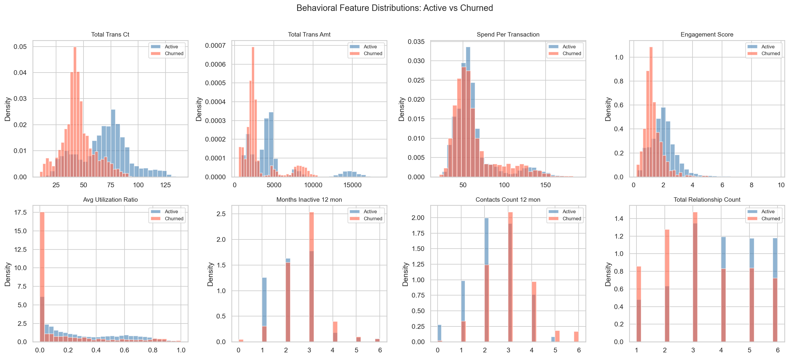
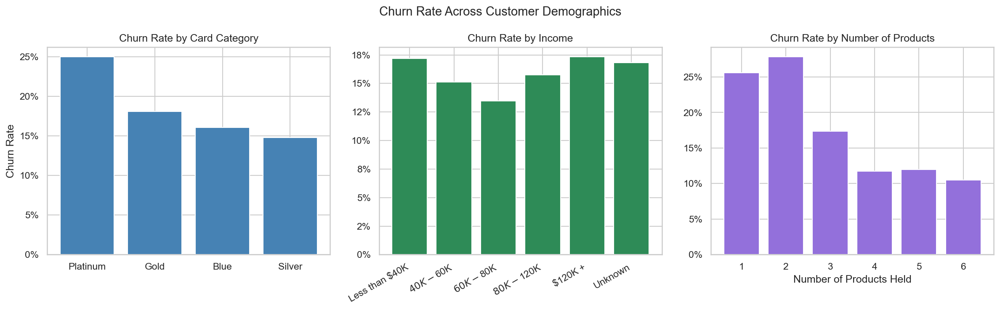
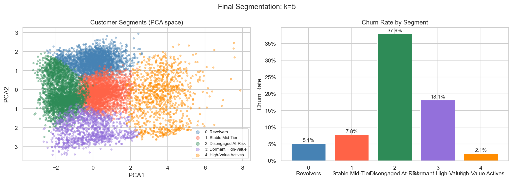
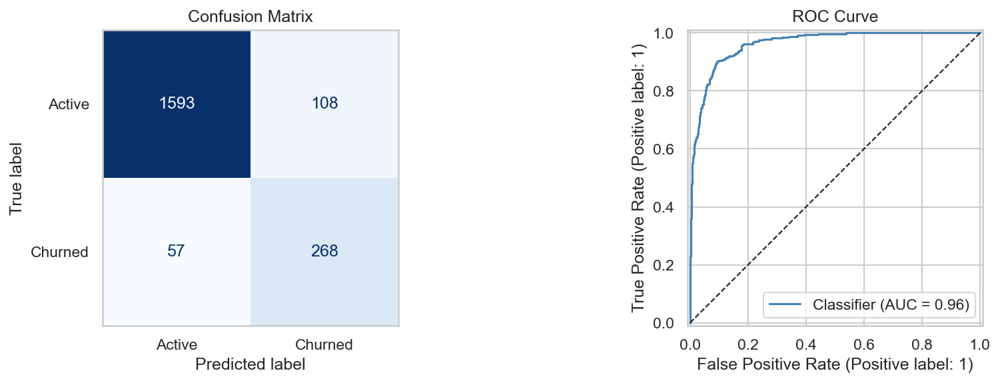
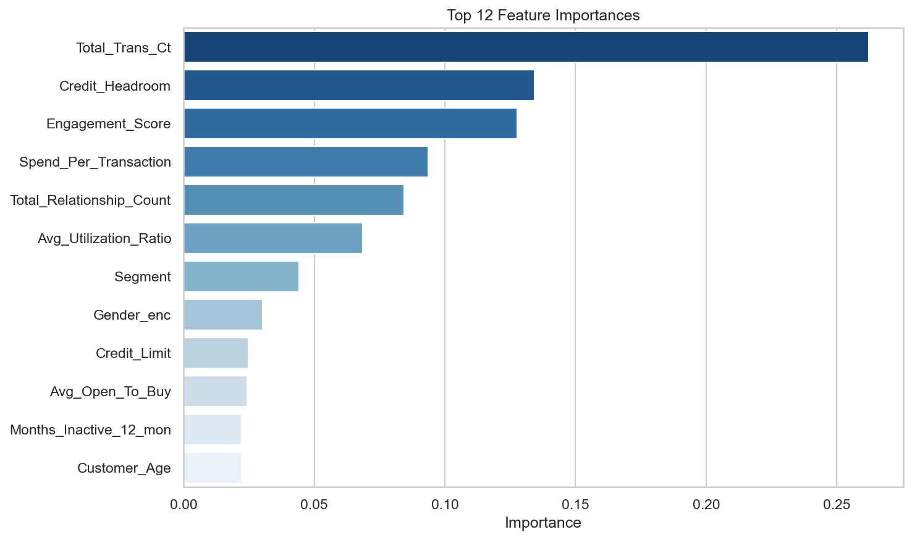
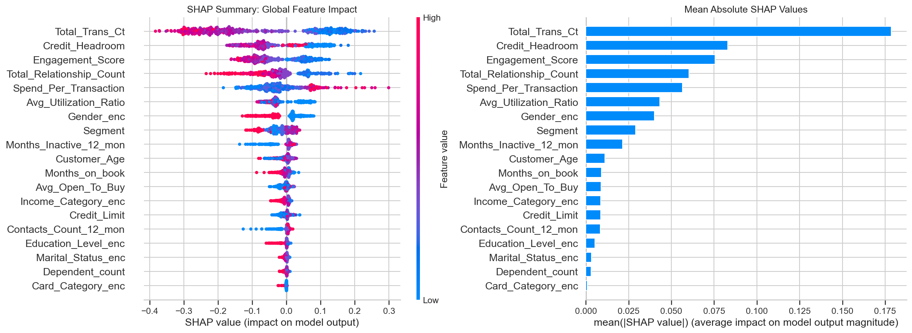

# Credit Card Customer Segmentation & Churn Intelligence

**Live demo:** https://credit-card-churn-dashboard.streamlit.app

A customer analytics project that segments credit card holders into behavioral
profiles and predicts churn risk, framed as a Relationship Manager
decision-support tool for a retail bank.

---

## What it does

The project runs in two stages. First it groups customers into five behavioral
segments using K-Means clustering. Then it trains a Random Forest classifier
to predict which customers are likely to churn, with SHAP explanations so the
model's reasoning is interpretable at the individual customer level.


---

## Key findings

Churners disengage behaviorally before they formally close their account.
Transaction count drops, inactivity rises, and contact frequency increases in
the months before churn. Two structurally different churn types exist: customers
who gradually disengaged, and customers who never really activated their card.



Month 3 of consecutive inactivity combined with elevated contact frequency is
the strongest early warning signal. Long-tenure customers are not necessarily
engaged, months on book correlates negatively with engagement score at -0.58,
meaning customers who have been with the bank longer are actually transacting
less relative to their tenure.

Product depth is the strongest retention lever. Customers with one product
churn at 25%+. Those with four or more churn at around 11%. Platinum card
holders churn more than Silver despite being the premium tier, suggesting card
prestige is a weaker retention signal than product relationship depth.



---

## Segmentation

Five segments identified via K-Means. k=5 was selected by profiling k=4
through k=6 rather than relying on silhouette scores alone. The Dormant
High-Value segment only became visible at k=5, with a churn rate 20 percentage
points lower than the broader at-risk group it was merged with at k=4.



| Segment | Churn Rate | Profile |
|---|---|---|
| Revolvers | 5.1% | Carry a balance, low credit limit, rate-sensitive |
| Stable Mid-Tier | 7.8% | Moderate engagement, not at immediate risk |
| Disengaged At-Risk | 37.9% | Low transactions, high contact frequency, urgent |
| Dormant High-Value | 18.1% | High credit limit, near-zero activity |
| High-Value Actives | 2.1% | Highest spend and engagement, cross-sell opportunity |

---

## Churn model

Random Forest trained on 19 features including six engineered behavioral
metrics. Class imbalance (84/16) handled via SMOTE on the training set and
balanced class weights.



| Metric | Score |
|---|---|
| ROC-AUC | 0.96 |
| Recall (churned) | 82% |
| Precision (churned) | 71% |

Optimized for recall because missing a churner is more costly than a false
alarm in a retention context.

---

## SHAP explainability





Transaction count is the dominant churn signal. Two of the top three features
are engineered (Credit_Headroom and Engagement_Score), validating the feature
engineering decisions. The Segment label adds incremental signal, and its
primary value is in driving differentiated RM action recommendations in the
Streamlit app.

---

## Streamlit app

Three pages:

**Portfolio Overview**: segment distribution, churn rates, churn probability
distributions, live BOT rate in sidebar with macro risk commentary.

**Customer Explorer**: input a customer profile and get their segment
assignment, churn probability gauge, macro-adjusted probability for Revolvers,
and a plain-English RM action recommendation.

**Segment Deep Dive**: select a segment and explore its behavioral profile
versus the portfolio average.

The sidebar pulls a live BOT rate proxy via yfinance and compares it to the
1.50% historical baseline from the dataset period. When the current rate is
elevated, Revolver segment churn probabilities are adjusted upward to account
for the increased cost of carrying a revolving balance.

---

## Stack

- **Data:** Kaggle BankChurners (10,127 customers, 20 features)
- **Wrangling:** Pandas, NumPy
- **EDA:** Matplotlib, Seaborn
- **ML:** scikit-learn (StandardScaler, PCA, KMeans, RandomForestClassifier),
  imbalanced-learn (SMOTE)
- **Explainability:** SHAP
- **Macro data:** yfinance (live BOT rate proxy)
- **App:** Streamlit, Plotly

---

## Project structure

```
credit-card-segmentation/
│
├── assets/
├── data/
│   ├── BankChurners_engineered.csv
│   ├── test_predictions.csv
│   ├── shap_sample.csv
│   └── shap_values_sample.npy
│
├── models/
│   ├── churn_model.pkl
│   ├── scaler.pkl
│   └── kmeans.pkl
│
├── notebooks/
│   └── customer_segmentation.ipynb
│
├── app/
│   └── app.py
│
└── requirements.txt
```

---

## How to run locally

```bash
pip install -r requirements.txt
streamlit run app.py
```

---

## A note on the dataset

The dataset is sourced from a US credit card portfolio. The BOT macro
adjustment layer demonstrates the analytical framework that would apply to
Thai retail banking data and is included to show how macro rate environment
affects segment-level churn risk. The segmentation methodology, churn
prediction framework, and SHAP explainability are all directly transferable
to a Thai banking context.
